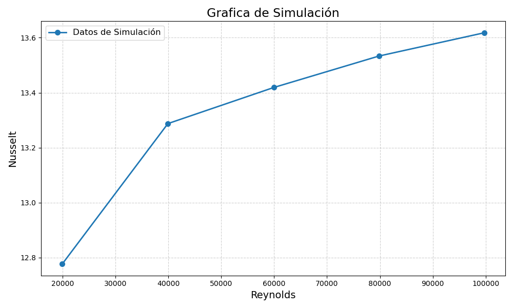

# 🌊*Graficos tipo paper en base a ANSYS*📊
```python
print("Hola")
print("Este es un proyecto en sus etapas iniciales")
print("El cual está pensado para ahorrar tiempo en la obtención de información")
print("Y graficar lo más relevante de tus simulaciones hechas en ANSYS")
print("Ya que, simular fenómenos físicos y entenderlos")
print("Me parece algo GENIAL!!!")
```

## 🔍*Características*
### - Lectura de archivos CSV
### - Creación de graficos por medio de datos
### - Capacidad de reenombrar variables o columnas
### - Convertir columnas a listas 
### - Visualización y edición de Graficos
## ⚙*Instalación*
### 1.- Clona el repositorio
### 2.- Instala las dependencias desde tu terminal: 
### pip install pandas matplotlib
### 3.- Ejecuta *Analisis_Datos_ANSYS.py*
## ▶*Cómo usar*
### 4.- Ingresa la dirección de tu archivo CSV como la nueva igualdad de *archivo*
### *Nota: Revisa como está escrita la dirección del archivo*
### 5.- Reenombra las P´s con el nombre de tus variables (puedes agregar o quitar P´s)
### 6.- Elige las columnas de tu archivo que quieres convertir a listas
### 7.- Opcional: Edita el grafico a tu gusto
## 🖼*Capturas*
### Grafico de Reynolds vs Nusselt

## 🛠*Tecnologías utilizadas*
### - Python 3.13.9
### - Pandas
### - Matplotlib
### - Git
### - Github
## 📈*Futuras mejoras*
### - Convertir a función el código completo
### - Visualización de distintos tipos de graficos
### - Respuestas automatizadas con base a los datos
### - Facilitar el reenombramiento de variables
## 📜*Licencia*
## 🗿*Autor*
### Ricardo Brayan Juarez Valencia